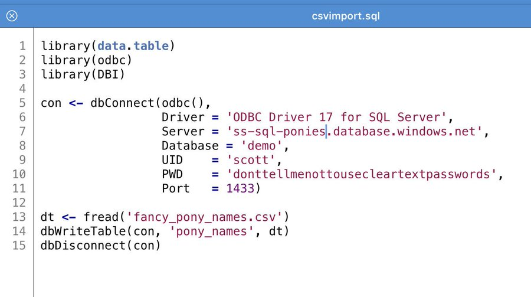

# Import CSV file to a Database, quickly

> Challenge: you have a csv file and you need to import it into a new table in a database. You have 5 mins to get it done. What tools do you use?
>
> [@secretgeek](https://twitter.com/secretGeek/status/1179515031190306817)

Below are many different solutions to this common problem, for a variety of databases and operating systems.

## Table of contents:

* [Any database with any OS](#any-database-with-any-os)
* [Any database with Windows](#any-database-with-windows)
* [Any Database with MacOS](#any-database-with-macos)
* [MS SQL Server Specific](#ms-sql-server-specific)
* [SQLite specific](#sqlite-specific)
* [MySQL specific](#mysql-specific)
* [Postgresql specific](#postgresql-specific)
* [Oracle specific](#oracle-specific)
* [Hadoop specific](#hadoop-specific)
* [Alternative: Just treat the CSV as SQL](#alternative-just-treat-the-csv-as-sql)

## Any database with any OS

- Python with Pandas

		import pandas
		from sqlalchemy import create_engine
		engine = create_engine('connection string')
		df = pandas.read_csv("path/to.csv")
		df.to_sql("table_name", engine)
- "R"

	Via [Scott Stanfield:](https://twitter.com/seesharp/status/1179569651119874048?s=20)

	> Load in R with data.table fread() method. It'll impute the data types...gets you 80% of the way there. 
	
- [csv2db](https://github.com/csv2db/csv2db) &mdash; "The CSV command line loader."
- [csvsql from csvkit](https://csvkit.readthedocs.io/en/1.0.2/scripts/csvsql.html)	

       csvsql --db postgresql:///test --tables dogideas --insert data/pets/dogideas.csv
- [NimbleText](https://nimbletext.com) &mdash; [Generate SQL Insert Statements with NimbleText (web version)](https://nimbletext.com/HowTo/GenerateInsert)
- [DBeaver](https://dbeaver.io/) &mdash; [Importing a CSV into a database using DBeaver](https://justnumbersandthings.com/post/2018-06-12-dbeaver-import-csv/)
- [Datagrip: import/export](https://www.jetbrains.com/datagrip/features/importexport.html) &mdash; "There is a dedicated UI for importing DSV (CSV and TSV) files to the database."
- [Navicat](https://www.navicat.com/en/) ($$$)

#### Some brute force approaches (common!)

- Sublime (editor), use Multiple line edit to turn the data into SQL
- vim, "A combination of macros, regex, and standard commands that change each line to an insert statement." (via [OJ](https://twitter.com/TheColonial/status/1180595464535601155?s=20))
- (Any editor), use search/replace (perhaps with regular expressions) to turn the data into SQL
- (Any spreadsheet), write formulae that combine the data together to turn the data into SQL, "`="('" + A1 + "','" + A2...`" etc.`
- [Automate the search/replace approach with NimbleText](https://nimbletext.com/Live/-63852033/) 

		$ONCE
		CREATE TABLE Contacts
		("<% $row.replace(/[ ]*,[ ]*/g,'" varchar(50) NULL,\n"') %>" varchar(50) NULL)
		GO

		Insert into Contacts
		('<% $row.replace(/[ ]*,[ ]*/g,"','") %>')
		Values
		$EACH+
		(<% ("'" + $row + "'").replace(/[ ]*,[ ]*/g,"','").replace(/'NULL'/g,'NULL') %>)<% if ($rowNumOne != $numrows) { ',' } %>
		$ONCE
		GO

## Any database with Windows

 - [LinqPad](https://www.linqpad.net/) &mdash; [CSV to IEnumerable (or Array) in Linqpad](/linqpad/csv_to_array.md)
 - Microsoft Log Parser

        Logparser -o sql -server 127.0.0.1 -database -createtable on "select * into newtable from C:\Apps\Logs\Logfile.log" 

 - [Alteryx](https://www.alteryx.com) ($$$)
    - drag in an `Input data`, point it at the csv file.
    - (optional) drag in a `Select`, use it to configure the column types
    - drag in an `Output data`, point it at the database (and set the table name)
    - Run!
	
 - [Generate SQL Insert Statements with NimbleText (desktop version)](https://nimbletext.com/HowTo/GenerateInsert)
   
	> The desktop version lets you use a "real" CSV parser that handles embedded delimiters/line breaks etc. Just switch on the `use qualifier` option under `tools` | `options`.

## Any Database with MacOS

(No examples available, so use solutions for "[Any database with any OS](#any-database-with-any-os)")

## MS SQL Server Specific

- Sql Server Management Studio (SSMS) &mdash; right click on Database, Tasks, "Import Flat File..."
- BCP (Bulk Copy Program)
- TSQL: [BULK INSERT](https://docs.microsoft.com/en-us/sql/relational-databases/import-export/import-bulk-data-by-using-bulk-insert-or-openrowset-bulk-sql-server?view=sql-server-2017)

		BULK INSERT Sales.Orders
		FROM '\\SystemX\DiskZ\Sales\data\orders.csv'
		WITH ( FIRSTROW = 2, FORMAT='CSV');

- Powershell: [Four Easy Ways to Import CSV Files to SQL Server with PowerShell](https://devblogs.microsoft.com/scripting/four-easy-ways-to-import-csv-files-to-sql-server-with-powershell/)
- Powershell: [Import-DbaCsv](https://docs.dbatools.io/#Import-DbaCsv) from [Chrissy LeMaire](https://twitter.com/cl)

        Import-DbaCsv -Path .\housing.csv -SqlInstance sql001 -Database markets -Table housing -Delimiter "`t" -NoHeaderRow
- [SQL Down under tools](https://sqldownunder.com/pages/sdu-tools) &mdash; see [ReadCSV demo movie](https://www.youtube.com/watch?v=ypuHanV2c6E&feature=youtu.be)

## SQLite specific

- [Tutorial: Import a CSV File Into an SQLite Table](https://www.sqlitetutorial.net/sqlite-import-csv/)

	If there are no header names in the csv, then find the column names and run:

		create table mytable (header_a, header_b, header_c) 

	Next step (do this whether you needed the previous step or not)

		.mode csv
		.import data.csv mytable

## MySQL specific

- [Load Data Infile](http://www.mysqltutorial.org/import-csv-file-mysql-table/)

		LOAD DATA INFILE 'c:/tmp/discounts.csv' 
		INTO TABLE discounts 
		FIELDS TERMINATED BY ',' 
		ENCLOSED BY '"'
		LINES TERMINATED BY '\n'
		IGNORE 1 ROWS;

- PhpMyAdmin

## Postgresql specific

Two techniques: `Copy` command in sql itself, and `\copy` command in `psql` (interactive commandline).

 - [Sql-copy](https://www.postgresql.org/docs/current/sql-copy.html) &mdash; requires root access

		COPY dog_habits FROM '/home/user521/pets/dog_habits.csv' DELIMITER ',' CSV HEADER;

 - [psql \copy](https://www.postgresql.org/docs/current/app-psql.html) &mdash; use interactive psql commandline where file permissions are an issue 

        psql -c "\copy sample FROM '/home/user521/pets/dog_habits.csv' WITH (FORMAT CSV)"

## Oracle specific

- [9 Simple Steps to Import CSV into Oracle Table Using Toad](https://www.foxinfotech.in/2018/07/9-simple-steps-to-import-csv-into-oracle-table-using-toad.html)

- [Oracle APEX](https://apex.oracle.com/en/)

   > "a couple of clicks and we're done"
   >
   > [@APEX/JeffreyKemp.sql](https://twitter.com/jeffreykemp/status/1179990364259663872)

## Hadoop specific

- [@BenBrandwood](https://twitter.com/ben_brandwood/status/1179689026930036736) gives this Hadoop example...

		hive> CREATE EXTERNAL TABLE IF NOT EXISTS test_ext
		> (ID int,
		> DEPT int,
		> NAME string
		> )
		> ROW FORMAT DELIMITED
		> FIELDS TERMINATED BY ','
		> STORED AS TEXTFILE
		> LOCATION '/test';
		OK
		Time taken: 0.395 seconds

## Alternative: Just treat the CSV as SQL

- [TextQL](http://dinedal.github.io/textql/) &mdash; Execute SQL against CSV or TSV.
- [q](https://harelba.github.io/q/) &mdash; Run SQL directly on CSV Files
- [RBQL](https://rbql.org) &mdash; Rainbow Query Language, a SQL-like language with JavaScript or Python backend.
- [PSKit Query](https://github.com/dfinke/PSKit#sql-query) &mdash; Powershell module lets you run simple queries over objects, including imported with csv.